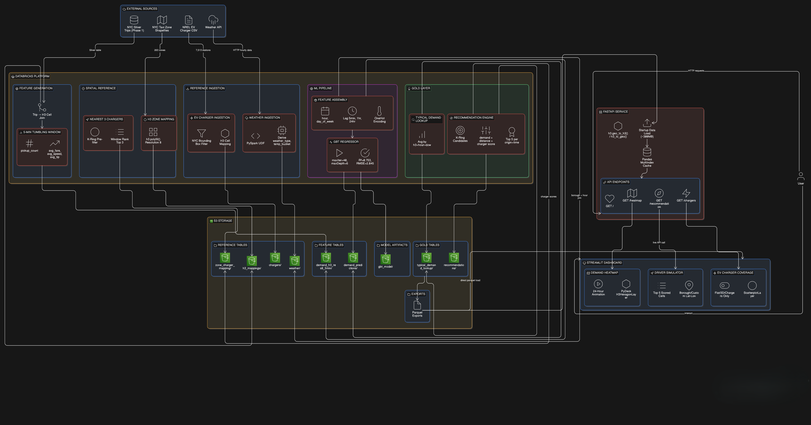

# NYC EV Taxi Intelligence - Adaptive Fleet Orchestration Platform

> **Phase 2** of the NYC Taxi Analytics project. Phase 1 (Lakehouse → Snowflake → Power BI) → [nyc-taxi-analytics](https://github.com/adb-21/NYC-taxi-analysis)

---

## Overview

NYC's Green Rides Initiative mandates a **100% zero-emission taxi fleet by 2030**. As of mid-2024, EV adoption is already outpacing projections, 19% of rideshare trips are now conducted in EVs, well ahead of the 5% annual target.

But electrification alone doesn't make the fleet smarter. NYC taxi drivers currently spend **60–73% of their operational hours driving empty**, a problem known as deadheading. For EV drivers, this is compounded by battery range constraints, limited charging infrastructure, and NYC's 2025 CBD Tolling Program which charges $0.75 per trip entering Manhattan below 60th Street.

This project builds a **data-driven recommendation system** that answers one question for an EV taxi driver:

> *"Where should I go next, considering demand, distance, and where I can charge?"*

---

## Architecture

```
NYC Silver Trips (Phase 1)
    + Open-Meteo Weather API
    + NREL EV Charger Dataset
              ↓
  H3 Spatial Feature Engineering
       (Databricks + PySpark)
              ↓
   GBT Demand Forecasting Model
        R² = 0.75 | MAE = 1.54
              ↓
  Gold Layer: Precomputed Scores
     (Delta Lake on Amazon S3)
              ↓
    FastAPI Serving Layer
   (reads parquet, no Spark)
              ↓
     Streamlit Dashboard
  Heatmap · Simulator · Chargers
```

> Architecture diagram:


---

## Key Design Decisions

**Precomputed recommendations over on-demand scoring**
All recommendations are precomputed across every H3 cell × 24 hours × 7 days of the week and stored as a partitioned Gold Delta table. The FastAPI layer reads from this table; no Spark at request time. This separates compute from serving, keeps API latency near-instant, and reflects a real production pattern.

**H3 resolution 8 for spatial indexing**
Uber's H3 grid at resolution 8 produces ~460m hexagons, fine enough to distinguish city blocks but coarse enough to aggregate meaningful demand signal. Unlike square grids, H3 hexagons have equal-distance neighbors in all directions, which is essential for k-ring candidate generation in the recommendation engine.

**Time-based train/test split**
Model evaluation uses a temporal cutoff (June 2025) rather than random splitting. Random splits on time-series data leak future patterns into training, producing unrealistically optimistic metrics.

**Geographic bounding box for charger filtering**
Rather than filtering EV chargers by city name (which misses lowercase variants and suburbs), the pipeline uses a coordinate bounding box (lat 40.45–40.95, lon -74.30 to -73.65) covering the full NYC metro area. This captures Jersey City, Hoboken, Yonkers, and other relevant cross-Hudson locations that a city name filter would silently drop.

---

## Tech Stack

| Layer | Technology |
|---|---|
| Data processing | Databricks, Apache Spark (PySpark) |
| Storage | Amazon S3, Delta Lake |
| Spatial indexing | H3 (Uber, resolution 8) |
| ML model | Spark MLlib GBTRegressor |
| Serving | FastAPI, Pandas (in-memory) |
| Visualization | Streamlit, PyDeck (H3HexagonLayer) |
| Reference data | Open-Meteo API, NREL EV charger dataset |

---

## Repository Structure

```
nyc-ev-taxi-intelligence/
    │
    ├── README.md
    ├── LICENSE
    ├── .gitignore
    │
    ├── databricks/
    │   ├── requirements.txt
    │   ├── ingestion/
    │   │   ├── 01_weather_ingestion.py
    │   ├── reference/
    │   │   ├── 02_build_h3_mapping.py
    │   │   ├── 03_create_zone_lookup.py
    │   │   └── 04_ev_charger_h3_mapping.py
    │   ├── features/
    │   │   └── 05_h3_demand_feature_generation.py
    │   ├── ml/
    │   │   └── 06_gbt_demand_model_training.py
    │   └── gold/
    │       ├── 07_build_zone_charger_mapping.py
    │       ├── 08_build_recommendations.py
    │       └── Export_features.py
    │
    ├── api/
    │   ├── main.py
    │   ├── recommendation.py
    │   ├── data.py
    │   ├── models.py
    │   └── requirements.txt
    │
    ├── streamlit/
    │   ├── app.py
    │   ├── data_loader.py
    │   ├── requirements.txt
    │   └── pages/
    │       ├── 1_Demand_Heatmap.py
    │       ├── 2_Driver_Simulator.py
    │       └── 3_EV_Charger_Coverage.py
    │
    ├── docs/
    │   ├── High-level-design-phase-2.png
    │   ├── Low-level-design-phase-2.png
    │   └── Demand-heatmap-animation.gif
    │
    └── data/
        └── README.md
```


---

## Databricks Pipeline

Run the notebooks **in numbered order**. Each notebook registers its output as a Delta table in the Databricks metastore.

| # | Notebook | Purpose |
|---|---|---|
| 01 | `weather_ingestion` | Fetches 3 years of hourly weather from Open-Meteo API for 6 NYC boroughs. Derives `is_raining`, `is_snowing`, `weather_type`, `temp_bucket`. |
| 02 | `build_h3_mapping` | Converts TLC taxi zone shapefiles (263 zones) to H3 res-8 cell lists via `h3.polyfill()`. Centroid fallback for small zones. |
| 03 | `create_zone_lookup` | Downloads and stores the TLC zone lookup table (zone name, borough). |
| 04 | `ev_charger_h3_mapping` | Assigns each charger its H3 cell via `geo_to_h3`. |
| 05 | `h3_demand_feature_generation` | Joins Silver trips to H3 mappings, assigns each trip a random H3 cell within its pickup zone, aggregates to 5-minute windows. |
| 06 | `gbt_demand_model_training` | Builds lag features (lag-1, lag-12, lag-288), joins weather, encodes categoricals, trains GBT model, evaluates, writes predictions. |
| 07 | `build_zone_charger_mapping` | For each H3 cell, finds nearest 3 chargers using H3 grid distance. Stores as pivoted priority columns (P1, P2, P3). |
| 08 | `build_recommendations` | Generates k-ring candidates per cell, scores on demand + distance + charger access, keeps top 5 per `(origin_h3, hour, day_of_week)`. Partitioned by hour and day for fast API lookups. |

### S3 Bucket Layout

```
s3://nyc-lakehouse/
├── reference/
│   ├── weather/
│   ├── chargers/
│   ├── h3_mappings/resolution_8/
│   └── zone_charger_mapping/
├── features/
│   ├── demand_h3_res8_5min/
│   └── demand_predictions/
├── models/
│   └── gbt_model/
└── gold/
    ├── typical_demand_lookup/
    └── recommendations/
```

---

## Demand Forecasting Model

### Features (24 dimensions)

| Feature | Description |
|---|---|
| `pickup_count` | Current window demand (lag-0) |
| `prev_demand` | Demand 5 minutes ago (lag-1) |
| `lag_12` | Demand 1 hour ago (lag-12) |
| `lag_288` | Demand same time yesterday (lag-288) |
| `window_start_hour` | Hour of day (0–23) |
| `day_of_week` | Day of week (1–7) |
| `avg_trip_distance` | Average trip distance in window |
| `avg_fare` | Average fare amount |
| `avg_speed` | Average speed in mph |
| `avg_tip_pct` | Average tip percentage |
| `avg_passengers` | Average passenger count |
| `temp_2m` | Temperature at 2m (°C) |
| `rain`, `snow`, `wind` | Weather measurements |
| `is_raining`, `is_snowing` | Binary weather flags |
| `weather_type_vec` | OHE: Clear / Rain / Snow |
| `temperature_bucket_vec` | OHE: Freezing / Cold / Moderate / Hot |

### Model Performance

| Metric | Value |
|---|---|
| R² | 0.753 |
| RMSE | 2.845 |
| MAE | 1.540 pickups per 5-min window |

### Feature Importance (top 5)

```
prev_demand        0.613   ← dominant signal, autocorrelation
pickup_count       0.191
lag_12             0.071   ← 1-hour pattern
window_start_hour  0.052   ← time-of-day effect
lag_288            0.033   ← same-time-yesterday pattern
```

**Note on weather features:** All weather features ranked near zero (< 0.001). This is not a data quality issue; the weather join was verified with < 0.1% null values. At a 5-minute prediction horizon, recent demand (lag features) already implicitly encodes weather shocks. Weather features may become meaningful at longer horizons (30+ min).

---

## Recommendation Scoring

For a given driver location at time T, the system:

1. Converts driver coordinates to an H3 res-8 cell via `h3.geo_to_h3(lat, lon, 8)`
2. Looks up precomputed top-5 recommendations for `(origin_h3, current_hour, current_day_of_week)` from the Gold table
3. Returns ranked candidates with coordinates, demand, charger info, and score

### Scoring Formula

```
charger_score = P1_fast×2.5 + P1_L2×1.0
              + P2_fast×1.5 + P2_L2×0.6
              + P3_fast×0.75 + P3_L2×0.3

final_score = 0.50 × norm(predicted_demand)
            − 0.25 × norm(grid_distance)
            + 0.25 × norm(charger_score)
```

All three components are min-max normalized within the candidate set for each `(origin_h3, hour, day_of_week)` group. DCFC fast chargers are weighted 2.5× over L2 chargers, reflecting their significantly higher utility for a working driver mid-shift. Priority discounts (P2 at 60%, P3 at 30%) reflect the practical reduction in usefulness of more distant chargers.

---

## Running the API

### 1. Export data from Databricks

Run the export script in Databricks to write Gold tables to your Volume as parquet files, then download them locally:

```
data/
├── recommendations/          ← partitioned parquet folder
├── typical_demand_lookup/    ← partitioned parquet folder
├── nearest_chargers/         ← parquet folder
└── ny_chargers/              ← flat parquet file
```

See `data/README.md` for full export instructions.

### 2. Install dependencies

```bash
pip install -r api/requirements.txt
```

### 3. Start the API

```bash
cd api
uvicorn main:app --reload
```

API available at `http://localhost:8000`. Interactive docs at `http://localhost:8000/docs`.

### Endpoints

| Endpoint | Method | Parameters | Description |
|---|---|---|---|
| `/` | GET | - | Health check |
| `/recommendation` | GET | `lat`, `lon` | Top-5 scored H3 zones for driver at given coordinates at current time |
| `/heatmap` | GET | `hour`, `dow` | All H3 cells with typical demand for a given time slot |
| `/chargers` | GET | `lat`, `lon` | 3 nearest EV chargers to given coordinates |

### Example request

```bash
curl "http://localhost:8000/recommendation?lat=40.7580&lon=-73.9855"
```

```json
{
  "driver_h3": "882a107735fffff",
  "hour": 18,
  "day_of_week": 5,
  "recommendations": [
    {
      "rank": 1,
      "h3_cell": "882a107739fffff",
      "lat": 40.761,
      "lon": -73.981,
      "predicted_demand": 8.4,
      "charger_score": 5.5,
      "grid_distance": 2,
      "score": 0.847
    }
  ]
}
```

**Valid coordinates:** NYC metro area only (lat 40.4–40.95, lon -74.3 to -73.65). Requests outside this range return HTTP 400.

---

## Running the Dashboard

### 1. Install dependencies

```bash
pip install -r streamlit/requirements.txt
```

### 2. Start FastAPI first (required for Driver Simulator page)

```bash
cd api && uvicorn main:app
```

### 3. Start Streamlit

```bash
cd streamlit
streamlit run app.py
```

### Pages

**Demand Heatmap**
H3 hexagon heatmap of NYC colored by predicted demand. Hour slider + day-of-week selector. Includes a 24-hour time-lapse animation showing demand shift across the city. Color ramp: blue (low) → yellow (medium) → red (high). Height = demand intensity.

**Driver Recommendation Simulator**
Input a borough preset or custom coordinates. Calls the FastAPI `/recommendation` endpoint and renders the driver's current cell (white) alongside top-5 recommended zones (red=1 → blue=5) on a 3D PyDeck map. Includes a results table with demand, charger score, distance, and final score per recommendation.

**EV Charger Coverage**
Demand heatmap overlaid with 1,621 charging station locations (green = DCFC fast charger, yellow = L2 only). Three view modes - Demand + Chargers (flat), Demand Only (3D), Chargers Only - allow clear inspection of both layers without WebGL z-layer conflicts between extruded hexagons and scatter dots.

---

## Known Limitations

**H3 cell assignment is approximate**
Raw TLC trip data provides only zone IDs, not GPS coordinates. Pickup H3 cells are assigned by randomly sampling from the zone's H3 cell list. This is a spatial approximation that introduces sub-zone-level noise in demand features.

**Weather features are uninformative at 5-min horizon**
All weather features ranked near zero in feature importance. At a 5-minute prediction horizon, lag features absorb weather effects implicitly. Weather data is retained in the pipeline for potential use at longer forecast horizons.

**No real-time trip data**
NYC TLC trip data is published monthly. The recommendation engine uses historical demand patterns (avg and p75 per time slot) rather than live trip counts. The system approximates real-time behavior by using the current hour and day of week to query precomputed typical demand.

**EV charger availability is static**
Charger locations and counts are sourced from the NREL dataset (static snapshot). Real-time charger availability is not integrated. In a production system, this would require a live API like OpenWeb Ninja EV Charge Finder.

---

## Project Context

This project was built as Phase 2 of a larger NYC Taxi Analytics platform, aligned with NYC's Green Rides Initiative and the real operational challenges introduced by fleet electrification and the 2025 CBD Tolling Program.

The problem and architectural framing draw from published research on urban mobility data engineering, including Uber's H3 spatial indexing work, NYC TLC electrification reports, and literature on taxi demand forecasting and EV charging optimization.

---

## Author

**Aakash Deepak Bartakke**
MS in Computer Science, Binghamton University | Data Engineering
[LinkedIn](https://www.linkedin.com/in/aakash-bartakke/) · aakashbartakke21@gmail.com

---

## License

This project is licensed under the MIT License - see the [LICENSE](LICENSE) file for details.

---

## 🤝 Contributing

Contributions, issues, and feature requests are welcome!  
Feel free to check the [issues page](../../issues).

---

## ⭐ Show Your Support

Give a ⭐️ if this project helped you!

---
